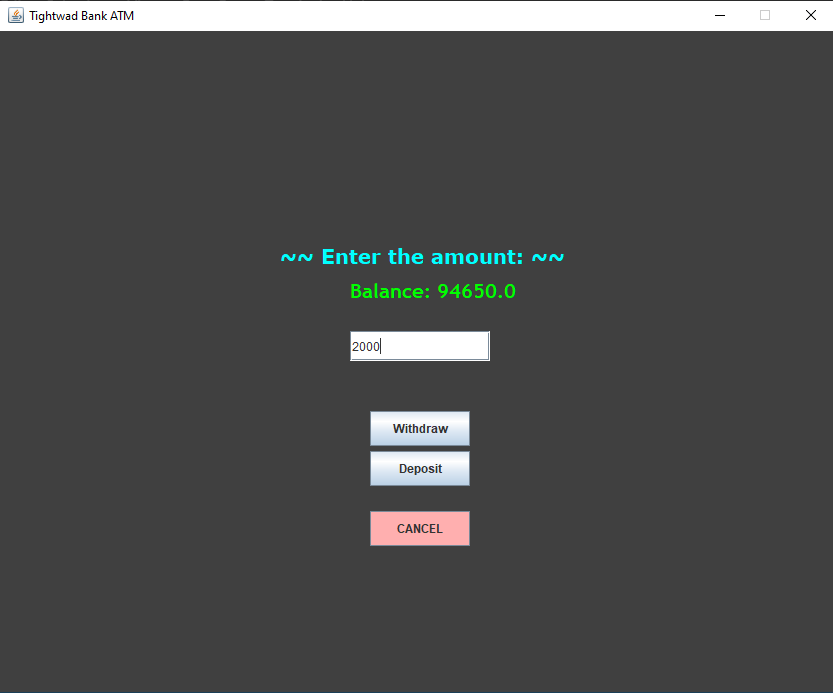
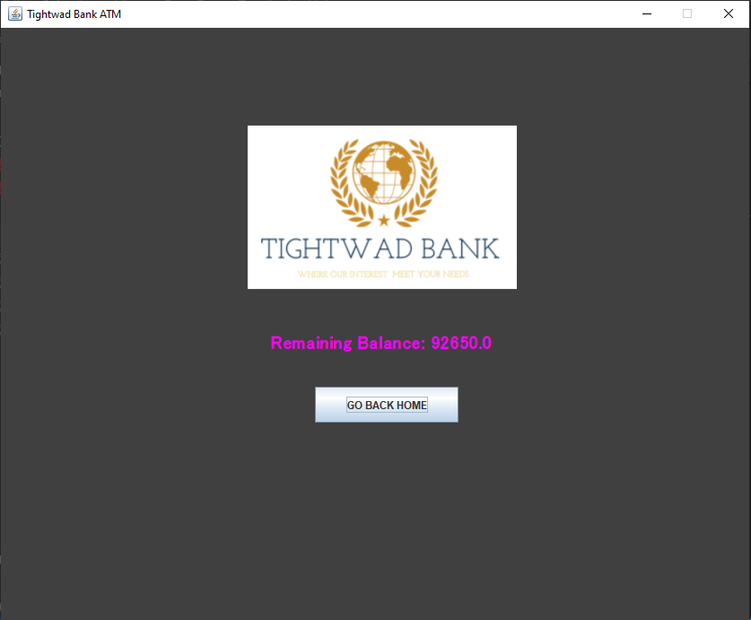

# ATM - CDM Simulator

This project simulates a simple atm-cdm. This was done as a part of our course activity in java for semester 3. 

# What did we do?

In this project we used java swing to model the GUI, and we connect to the database ,which holds the account information, using JDBC. We used card layout to manage the different pages.

We have a total of 4 pages in this project.

1. First is the welcome page which displays a basic welcome message and gives a textfield to enter the account number, here account number is used in place of inserting a card to identify the customer. Then we have a submit button which verifies the details and takes you to the next page. The flashing colours was done using "Timer", more on that can be found [here](https://docs.oracle.com/javase/tutorial/uiswing/misc/timer.html). A logo and a punchline of the bank is given here.

2. If the account exists, then you'll be taken to the pin page to enter the pin. In the pin panel page, we gave physical number keys to enter the pin to maintain security of the application. There are two buttons continue and clear. Clear clears the input and resets it. Continue verifies the entered pin and takes you to the next page. Do note that there is a 4 attempt limit on entering the pin.

3. If the pin is correct you'll be taken to the withdrawal/deposit page. Here we have a textfield to enter the amount, two buttons, withdraw and deposit, which withdraws and deposits the entered amount. For withdrawal min. amount is 100. There is also a label that displays your current balance.

4. After doing the actions we are taken to the thank you page, which shows a thank you message and show the remaining balance after the operation you've done. The flashing thank you is done in the same way as welcome. There is button which takes back to the homepage.

Appropriate error messages will be displayed upon failure of conditions at any pages. Cancel buttons have been given in pages 2 and 3 to cancel the transanction at anytime.

# References

1. https://docs.oracle.com/en/java/
2. https://www.javatpoint.com/
3. https://stackoverflow.com/ 
